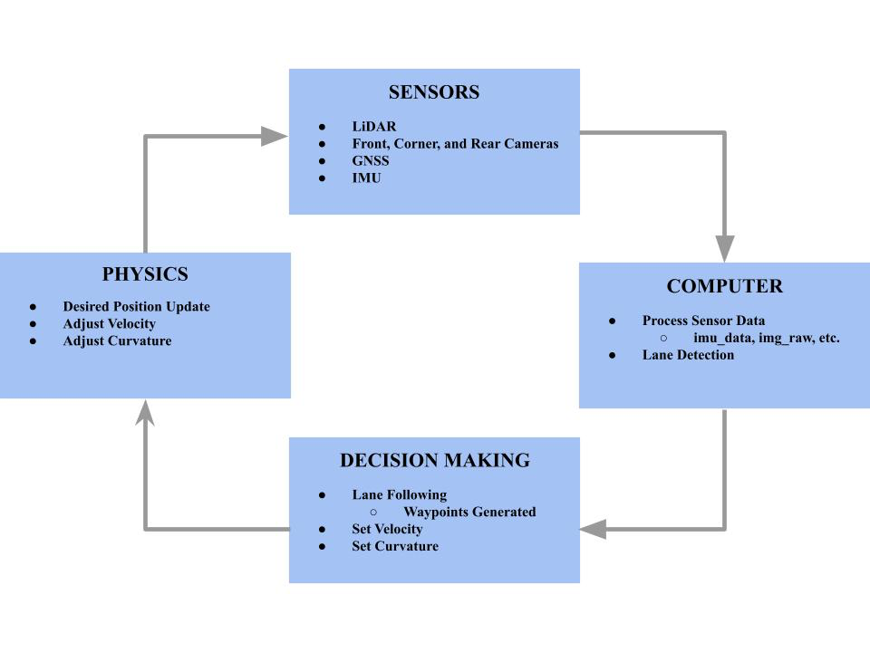
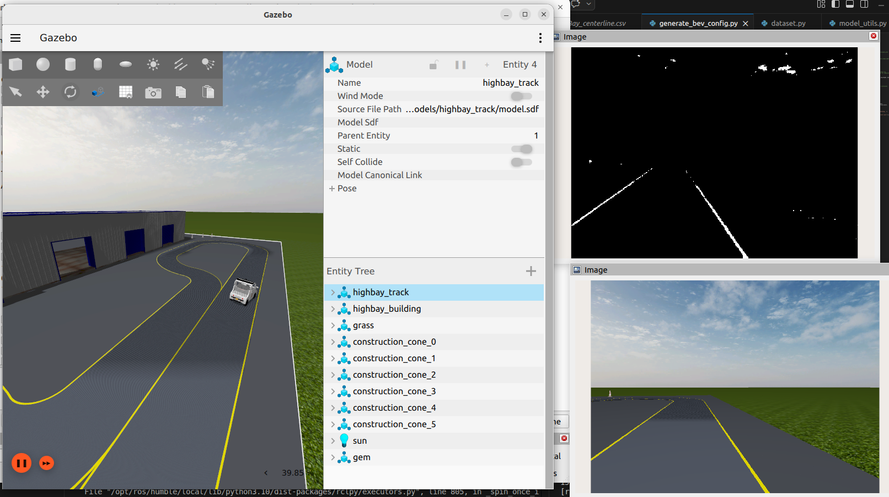
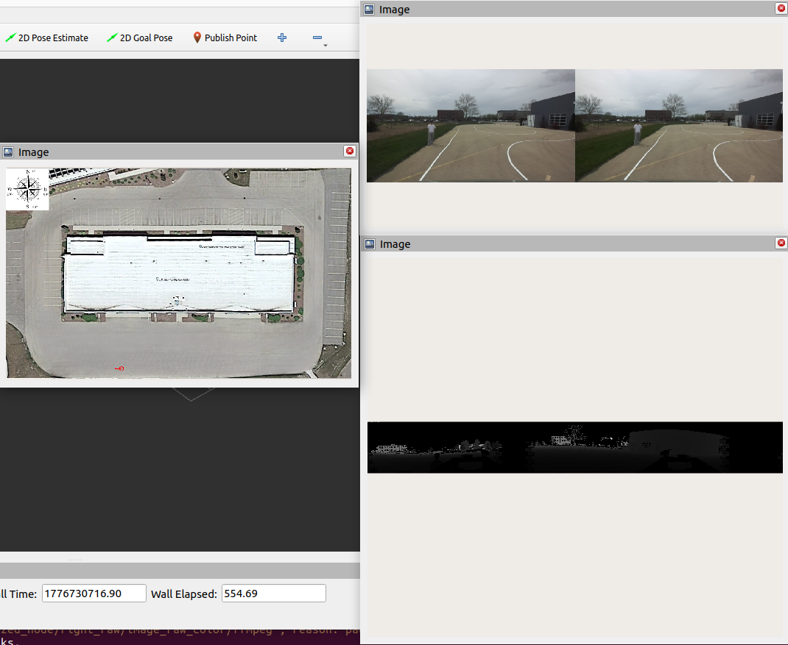

::: {.hero-section}

# Autonomous Navigation for the Polaris GEM e2 {.title}

::: {.subtitle}
Precision Lane Tracking and Intelligent Parking for a Modern Robotaxi.
:::

::: {.author-list}
[**Aditya Korlahalli**](https://example.com)^1^,
[**Gokul Narayan**](https://example.com)^1^,
[**Ishaan Kandamuri**](https://example.com)^1^,
[**Shyam Peden**](https://example.com)^1^
:::

::: {.affiliation-list}
^1^University of Illinois Urbana-Champaign
:::

::: {.button-row}
[ Video](https://www.youtube.com/watch?v=cSQTZoZPJzs){.btn .btn-primary}
:::

:::

::: {.section-container}
::: {.hero-teaser}
{.teaser-img}
:::
:::

::: {.section-container}
## Abstract {.section-title}

::: {.abstract-text}
We will be working on a full-scale autonomous vehicle, the Polaris GEM e2. Using this car and what we have learned throughout the semester, we plan on implementing several features. The first feature is the most obvious: **have the car stay in the lanes**. Whether the car is on a straight or a turn, the car must stay in the lane to ensure proper functionality. We also want our car to be able to **detect obstacles on the road**. This all relates to us wanting to generate an autonomous car that potentially could drive on a real road. If the car detects a stop sign, we want our car to stop for a certain amount of time to simulate what a car should do in the real world. Similarly, we want the car to stop in an emergency if an obstacle is detected in the car’s path. 

One final feature that we think would be difficult, but interesting to implement, is that the car **can park by itself**. We want the car to be able to detect parking lines, and once it finds an empty spot, we can program the car to park itself. An additional level of execution would be adding **parallel parking** to the car. We think this is doable as we can use the cameras to determine how to drive the car into a parallel park. Parallel parking involves parking vertically between two cars. We could potentially use something to mark where the driver’s side of the first car is. The camera can pick up where this is and then line up to it. From there, we can have the car reverse until one of the cameras picks up both headlights of the “back car”. Then, the car can change the steering and finally finish the parallel parking. This would be difficult, but we think that it is doable. 
:::
:::

<!-- ============================================================ -->

<!-- BLOCK DIAGRAM -->

<!-- ============================================================ -->

::: {.section-container}
## Block Diagram {.section-title}

::: {.result-card}
{.block_diagram-img}
:::

::: {.content-text}
Above is our block diagram that we plan on implementing. Using the cameras and sensors on the car, we will get our needed information to pass into the computer. Once we have this, our program will run considering the values and send information to help with the car's decision-making process. For example, we want to follow inside the lanes. So, we want to make a decision to speed or slow down, and turn the steering wheel a certain way based on where in the lane we are. Finally, we will adjust the speed of the car, turn the wheel if needed, and update the current position.
:::
:::

<!-- ============================================================ -->

<!-- OVERVIEW / METHOD VIDEO -->

<!-- ============================================================ -->

::: {.section-container}
## Video of Lane Detection {.section-title}

::: {.video-container}

:::

::: {.content-text}
In this video, we are running the lane detection on the information we received from the rosbag. We drove the car to collect this information around the track, put it in a flash drive, and tested it in the simulation. The issue that we came across was that it was very noisy, which could pose an issue in the future for the controller. So, we think that we might have to design our controller not completely relying on where the lanes go because it could result in a faulty controller.
:::
:::

::: {.section-container}
## Lane Detection and Following in Highbay Simulation {.section-title}

::: {.result-card}
{.highbay-lane-img}
:::

::: {.content-text}
We  implemented and tested our lane masking algorithms within the Gazebo simulation environment using the highbay track. Currently, we still need to do some additional filtering and tuning to generate the BEV and fitted trajectory curve. This planned setup will allow us to verify our computer vision pipeline—extracting raw image data and processing it into binary masks—ensuring the vehicle could identify lane boundaries before we deploy IRL.
:::
:::


::: {.section-container}
## Rosbag Replay from IRL Driving {.section-title}

::: {.video-container}

:::

::: {.content-text}
Here is the IRL driving replay from our Rosbag.
:::

::: {.result-card}
{.camera_views-img}
:::
:::

<!-- ============================================================ -->

<!-- NEXT STEPS -->

<!-- ============================================================ -->


::: {.section-container}
## Next Steps {.section-title}

::: {.content-text}
After completing the IRL lane following for the GEM e2, our next step would be to integrate the park-to-drive for a given parking location. This would go hand in hand with our desire to integrate parallel parking on the vehicle. The final step after this would be to recognize stop signs, pedestrians, and other potential obstacles. 
:::
:::

<!-- ============================================================ -->

<!-- BIBTEX -->

<!-- ============================================================ -->


::: {.section-container}
## BibTeX {.section-title}

```bibtex
@article{AutonomousNavigationPolarisGEMe2,
  author    = {Aditya Korlahalli and Gokul Narayan and Ishaan Kandamuri and Shyam Peden},
  title     = {Autonomous Navigation for the Polaris GEM e2},
  journal   = {ECE 484 Final Project},
  year      = {2026},
}
```

:::

<!-- ============================================================ -->

<!-- FOOTER -->

<!-- ============================================================ -->


::: {.site-footer}


This website template is adapted from the

[Nerfies](https://nerfies.github.io) project page, which is licensed under a

[Creative Commons Attribution-ShareAlike 4.0 International License](http://creativecommons.org/licenses/by-sa/4.0/).


:::